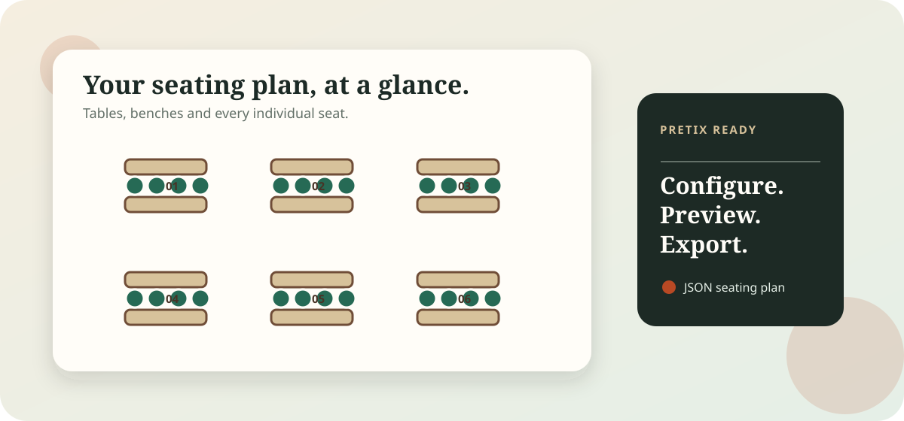
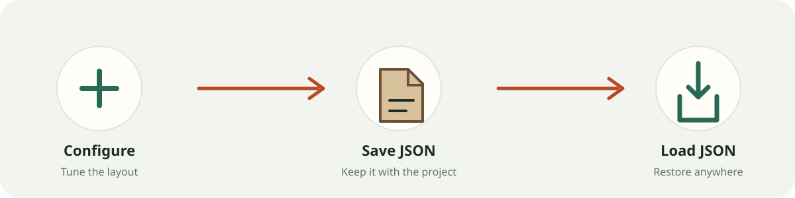

# Beer Benches Seating

> A practical, pretix-compatible seating-plan generator for Oktoberfest-style beer benches.

[**Open the live app →**](https://beer-benches-seating.ml-events.eu)



Configure a room layout, inspect every table in a live SVG preview, and export the JSON accepted by the [pretix seating-plan editor](https://seats.pretix.eu). Pairs are kept on opposite benches by design.

## Highlights

- **Live seating-plan preview** — zoom, pan and inspect tables before exporting.
- **Flexible layout controls** — table grid, seat count, gap patterns and table-numbering direction.
- **pretix-ready JSON** — download a plan that can be imported into the pretix seating-plan editor.
- **Persistent browser settings** — your configuration survives reloads in Local Storage.
- **Portable settings files** — save the current configuration as JSON and load it again for another event or project.



## Use it

1. Open the [live app](https://beer-benches-seating.ml-events.eu).
2. Set the table dimensions, seat count and numbering pattern.
3. Check the generated plan in the interactive preview.
4. Download the pretix JSON when it looks right.

Use **Save settings** to download a `beer-benches-settings.json` file alongside your project files. **Load settings** restores it later; settings are also retained locally in the browser. **Reset settings** returns the form to its defaults.

## Run locally

```bash
python -m venv .venv
. .venv/bin/activate
pip install -r requirements-dev.txt
uvicorn app.main:app --reload
```

Open `http://localhost:8000`, adjust the layout and click **Download pretix JSON**.

The original command-line generator remains available:

```bash
python seating.py
```

It writes `seating.json` using the default configuration.

## Test

```bash
pytest -q
```

## Container

```bash
docker build -t beer-benches-seating .
docker run --rm -p 8000:8000 beer-benches-seating
```
